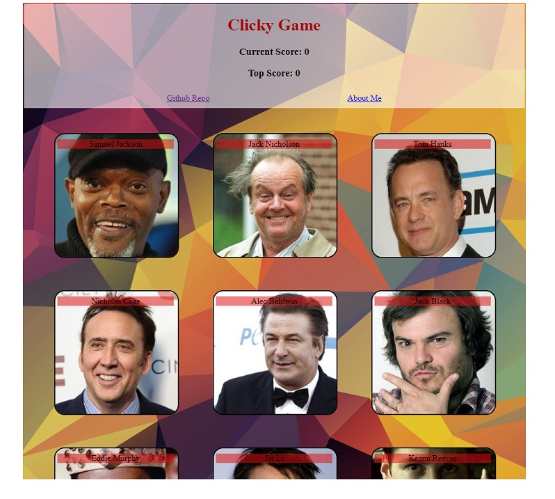

# Clicky Game

#### How To Use:
When the app loads, you will see pictures of nine male actors.  When one is clicked, the pictures are shuffled, and the counter will increase by one.  Try to click all of the actors without hitting the same one twice.  If you click any twice, the game is over and will reset.

[See it Live](https://akaryrye.github.io/clickygame/)

#### Installation:
HTTPS:   `$ Git Clone https://github.com/akaryrye/clickygame.git`

SSH:   `$ Git Clone git@github.com:akaryrye/clickygame.git`

`npm install` to install dependencies

`npm start` to run the app (http://localhost:3000)

#### Technologies:
React JS, CSS

#### Author:
Ryan K Alldrin

This project was bootstrapped with [Create React App](https://github.com/facebook/create-react-app).

Thank You and I hope you enjoyed this App!
